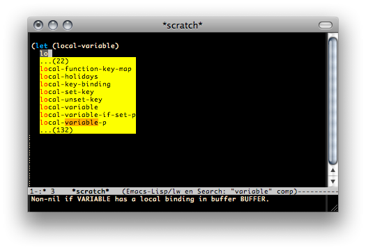
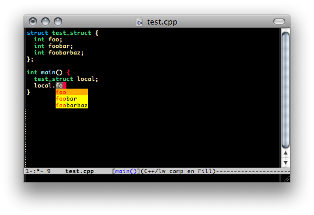

Company Mode
====

About
----

Company is an Emacs extension for performing text completion.

Completion candidates are retrieved from a variety of back-ends, such as
`abbrev`, `Semantic`, `Eclim`, `etags`, etc.

Screenshots
----

Installation
----

This package is part of [GNU ELPA](http://elpa.gnu.org/) (<kbd>M-x
list-packages</kbd>).

Usage
----

Once installed, enable company-mode with <kbd>M-x company-mode</kbd>.

Completion will start automatically after you type a few letters. Use
<kbd>M-n</kbd>, <kbd>M-p</kbd>, <kbd>\<tab\></kbd> and <kbd>\<return\></kbd> to
complete. Search through the completions with <kbd>C-s</kbd>, <kbd>C-r</kbd> and
<kbd>C-o</kbd>.

To use `company-mode` in all buffers, add the following to your init file:

    (global-company-mode)

To set up preferred back-ends, customize `company-backends`.

Also see this variable's docstring for information on writing a back-end.

For more information, see the docstring for `company-mode`.

Feedback
----

If you experience any problems or have a feature request, use the
[Issue Tracker](https://github.com/dgutov/company/issues).
